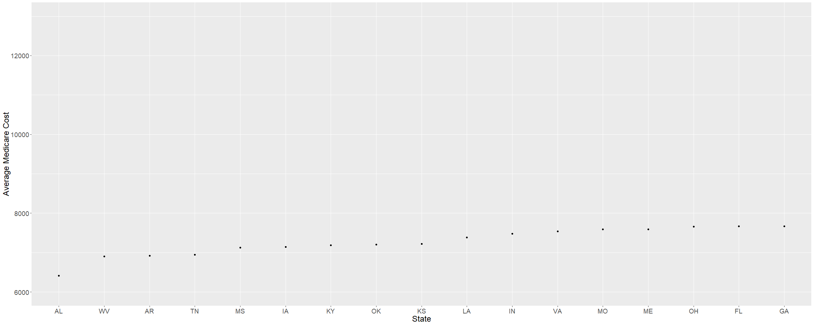
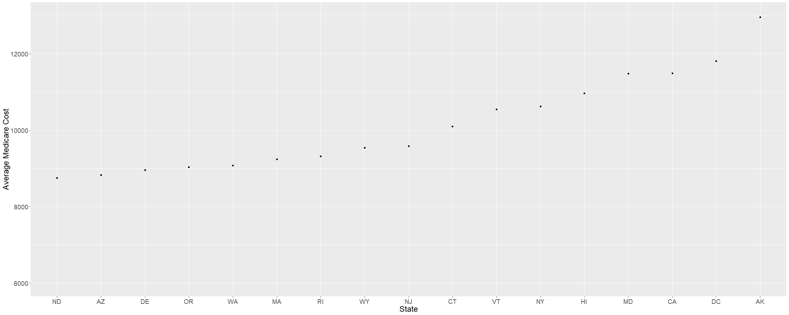
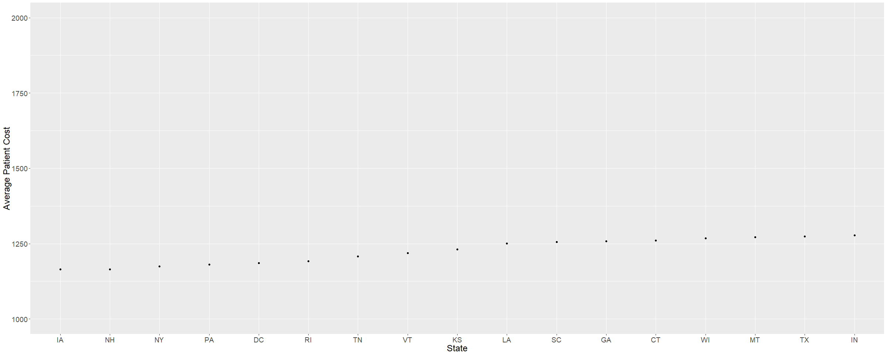
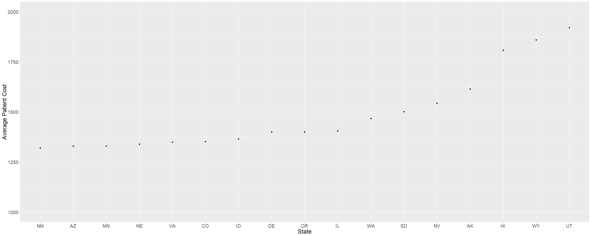
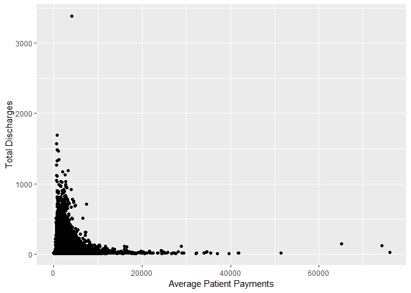
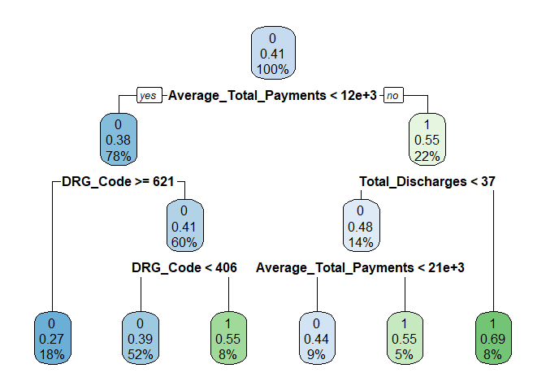

*What's the problem?*

Medical costs continue to climb. Patients often feel they can't afford
the medical care they need. Due to the high cost, many patients either
choose or are forced to forgo their procedure(s), which means their
health continues to decline. There are two groups patients blame when
they feel the cost of healthcare is too high: medical facilities and
insurance providers.

As an insurance provider, you want to keep patients healthy, and you
want them to be happy with their insurance product. The healthier the
patient, the less expensive their care will be both for them and the
company paying the claims. And if they feel their insurance is helping
them find affordable care, they're more likely to continue business with
that company as well.

*What's the solution?*

Even though medical care is expensive, there are cheaper options for
patients, as each facility has their own negotatied rates. As an
insurance company, you can help your patients determine an affordable
alternative within their area. This will make the patient more likely to
recieve the necessary procedure and they'll feel like their insurance
cares about their needs.

*How do we achieve this goal?*

I have created a web-based application that shows average Medicare
patient pricing by county for the 100 most common inpatient procedures.
This tool can be used to help patients determine nearby counties that
can offer a less expensive out of pocket. The application can also be
used to pinpoint areas to focus testing new methods to help lower costs.
For example, Medicare patients within the most expensive counties could
be sent an automatic call at certain times of the year to remind them to
schedule their preventative care. We could also try offering special
screening days for patients with educational sessions for them to
attend. Staying on track with their checkups and screenings can help
patients avoid more drastic inpatient procedures later on, which will
save money in the long term. The idea is that this application is just
the beginning, and will eventually become a tool to guide patients to
specific lower cost facilities within their area. Other data can easily
be applied to this framework and the current dataset can be expanded as
new data becomes available, meaning the application can be used for
multiple patient populations.

THE PROCESS
-----------

*Cleaning the data*

The original dataset from cms.gov shows pricing information for the top
100 inpatient DRG codes in the United States by facility. Values
included are the DRG codes used, a unique identifier for each provider,
provider address, provider name, provider zip code, average covered
charges (the amount the hospital charges for the procedure that is
covered by Medicare), average total payments (the Medicare negotiated
rate plus patient deductible and coinsurance), and average Medicare
payment (Medicare negotiated rate minus patient deductible and
coinsurance). The data was already relatively clean in its original
form, and there were no missing values, but I separated the DRG code
from the DRG Definition to make analysis easier. I also created a new
variable, average patient payments, by taking the difference between the
average total payments and the average Medicare payments. For this
implementation on the application, I chose to create a choropleth map
rather than use markers. Since zip codes don't have definitive
boundaries, I chose to map the data by county. I joined my cleaned
dataset with a zip code database that includes zip codes and counties in
order to group the facilities by county. I then took a shapefile of
counties from the US census and joined my dataset to the shape file,
adding a column for average patient out of pocket per county as well.
Lastly, I made a new dataset that calculated the average patient out of
pocket for each DRG code per county for a more in depth analysis.

*Analyzing the data*

After cleaning the data, I ran basic analysis by state to get a feel for
the dataset. I wanted to determine if there were substantial differences
in trends across the US for Medicare prices versus patient costs. I
first created a ranking of states by average Medicare costs across all
codes and all facilities. I created a subset of the original data and
added a new variable, mean medicare pay to show the average Medicare
cost for each state. I plotted this new dataset by state to see a
ranking of all 50 states (plus Washington D.C.). I expected to see the
states containing the largest cities and highest cost of living in the
top 10 (mainly New York, California, Florida, Illinois, Massachusetts,
Washington D.C., etc). I was quite surprised to see that Alaska,
Wyoming, and Connecticut all made it into the top 10, while Florida and
Illinois weren't even in the top 20.

I then created a new ranking showing average patient out of pocket
across the states. I created a new variable to show this average. I then
plotted the new subset, creating a ranking I could compare with the
Medicare price ranking above. I expected the rankings to have quite a
bit of overlap, but found many differences. Very few states retained a
similar position. And again, many states with large cities and high cost
of living remained outside of the top 10.

Lastly, I analyzed the relationship between total discharges and patient
out of pocket prices. I made a graph plotting patient costs against
total discharges, which shows that as total discharges decrease, average
patient payment tends to increase. This means that when a facility
performs a procedure more often, the patient cost tends to lower.

*Predictive model*

I created a model to predict average patient out of pocket based on a
binary of average patient costs under $1000 and average patient costs
over $1000. I started with a basic CART model, splitting the data into a
training and testing set, and setting a minbucket of 25. Once I created
the tree, I used it to predict average patient payment with an accuracy
of about 0.628.

    ##    predict_binary_tree
    ##         0     1
    ##   0 41704  6859
    ##   1 23976 10441

    ## [1] 0.6284044

After creating the first model, I used 10-fold cross validation and
determined the best cp for the model. I found 0.001 to be the best cp
value, and I used that value to create a new tree. I ran a new
prediction with my test set and increased the acccuracy to about 0.655.
The accuracy of this model defintely beats the baseline. I would like to
continue feature engineering to attempt an even better model.

    ##    predictCV
    ##         0     1
    ##   0 40869  7694
    ##   1 20884 13533

    ## [1] 0.6556038

\`\`\`

*Making the application*

To make the application I used the shiny package in R. I created a
choropleth county map based on average patient costs per county, adding
interactivity to the map so that users can highlight a county to see the
name and average patient cost. I added a select input with a table
output to show the 10 cheapest counties per state. I then used ggplot2
to create a graph showing average patient costs by DRG code and county,
with a select input available for users to choose a DRG code. Due to the
complexity of the names associated with each code, I opted to just use
the DRG code for now. The final application can be found at:
<https://rmarciano.shinyapps.io/MedicarePatientPricing/>.

*What will be improved in the future?*

There are many improvements I would like to make in the future, mainly I
would like to perform a Kruskal Wallis statistical test to see if there
is any significant difference in average pricing between regions of the
US. I also plan to use this framework to create an application that will
suggest specific facilities to patients based on their zip codes.

Data retrieved from:
<https://data.cms.gov/Medicare-Inpatient/Inpatient-Prospective-Payment-System-IPPS-Provider/97k6-zzx3>
<http://census.ire.org/data/bulkdata.html>
<https://www.unitedstateszipcodes.org/zip-code-database/>
